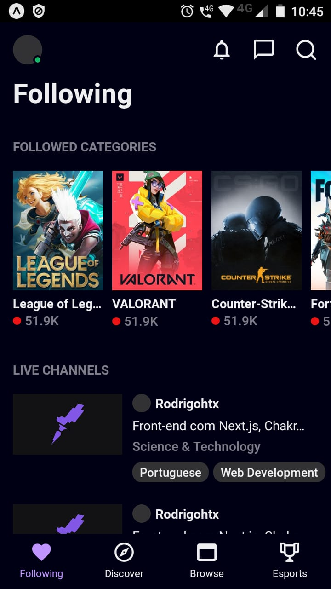
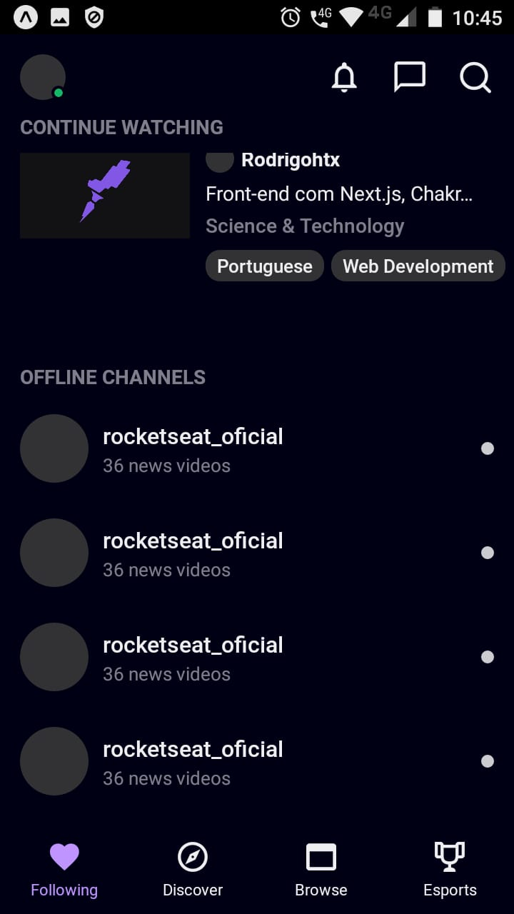

  

  

<h1 align="center">
  Twitch Interface
</h1>

<h4 align="center"> 
	🚧  Twitch Interface 🧍‍♀️🧍‍♂️ Concluído 🚀 🚧
</h4>

  <a href="#-sobre-o-projeto">Sobre</a> •
  <a href="#-como-executar-o-projeto">Como executar</a> • 
  <a href="#-tecnologias">Tecnologias</a> • 
  <a href="#-autor">Autor</a> • 

## 💻 Sobre o projeto

🎮Twitch - é uma plataforma de streaming focada para o público gamer. Este repositório é um UI Clone da interface da Twitch.

projeto desenvolvido junto ao canal da Rocketseat **UI Clone** [Rocketseat](https://www.youtube.com/playlist?list=PL85ITvJ7FLohTZv9cC5-PrZ39Q3cugWqp).

---

### Twitch Interface

  
  

---

## 🚀 Como executar o projeto

### Pré-requisitos

Antes de começar, você vai precisar ter instalado em sua máquina as seguintes ferramentas:
[Git](https://git-scm.com), [Node.js](https://nodejs.org/en/).
Além disto é bom ter um editor para trabalhar com o código como [VSCode](https://code.visualstudio.com/)

Baixe o arquivo <a href="https://github.com/RodrigoJuniorLiyah/UI-Clone-twitch-interface/archive/video-entrypoint.zip">Aqui</a>

✔ Em seu editor execute yarn install ou npm i 
✔ Execute yarn start ou npm run build 
🐱‍👤 Pronto, seu projeto irá ser executado! 
🐱‍👓 Recomendo utilizar o aplicativo expo em seu smartphone para ter uma melhor experiência.

---

## 🛠 Tecnologias

As seguintes ferramentas foram usadas na construção do projeto:

- **[Expo](https://expo.io/)**
- **[React Native](https://reactnative.dev/)**
- **[Typescript](https://www.typescriptlang.org/)**
- **[VScode Styled Components](https://marketplace.visualstudio.com/items?itemName=jpoissonnier.vscode-styled-components)**

## 🐱‍👤 Autor

 
 <b>Rodrigo junior 🚀</b>
  

 
